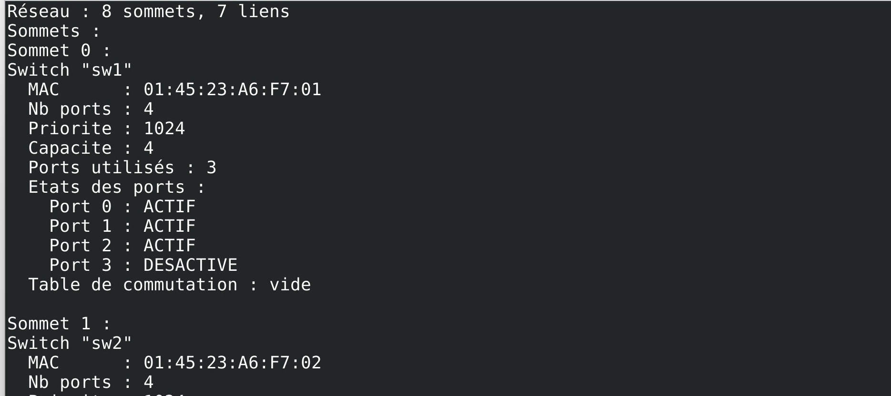
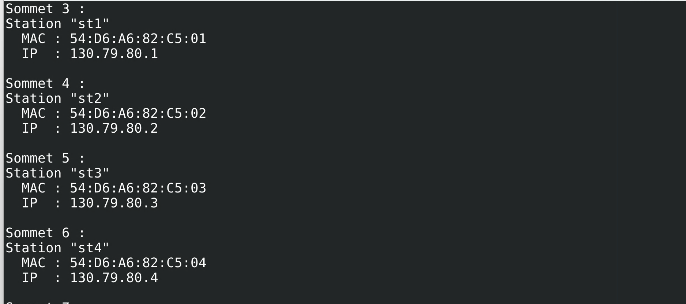
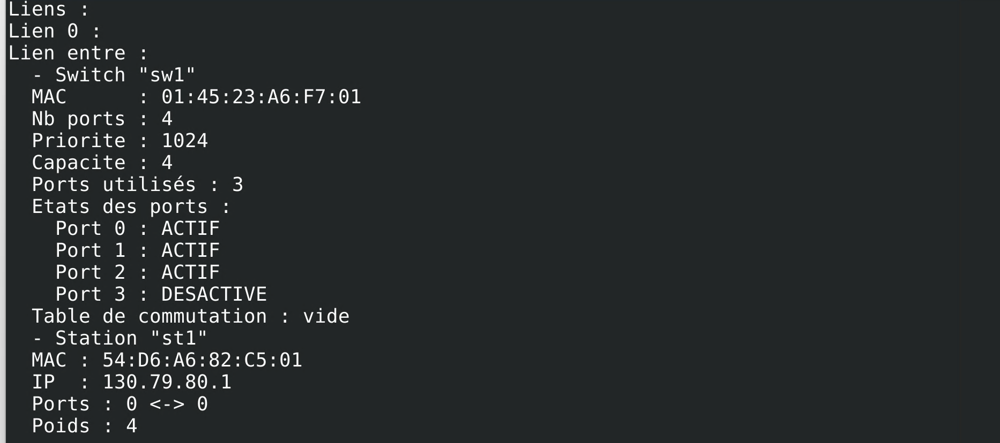
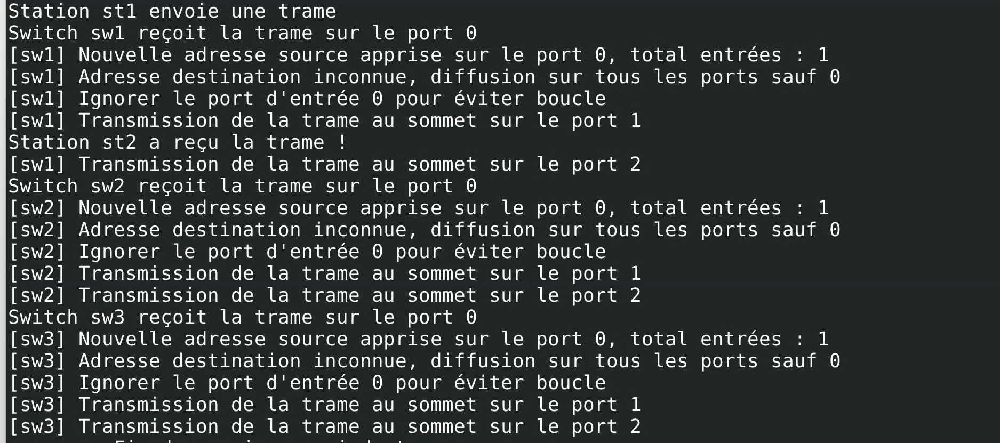

# Simulation d'un réseau

- Membres du goupe : [Jean GIESE](https://git.unistra.fr/jgiese), [Hugo LEGER](https://git.unistra.fr/legerh)

## Installation / lancement de la simulation

Ouvrez un terminal et mettez-vous dans un répertoire où vous placerez le projet

### Mise en place du dépôt Git

1. Installer git sur votre ordinateur personnel (rien à faire si vous avez déjà Git) :
```sh
$ sudo apt install git
```

2. Configurer vos informations d'utilisateur :
```sh
$ git config --global user.name "[Prenom] [Nom]"
$ git config --global user.email "[email]"
```

3. Cloner ce dépôt sur votre ordinateur personnel :
```sh
git clone https://github.com/Jean-GIESE/Simulation-d-un-reseau.git
```
Si vous n'avez pas le language C sur votre ordinateur, installez-le

### Lancement de la simulation

Allez dans le répertoire `Simulation-d-un-reseau` et tapez la commande `make`, cela va vous créer un fichier dans le répertoire **bin** nommé `/bin/main`.

Pour exécuter le programme, tapez la commande `./bin/main`
Dans le fichier `main.c` nous utilisons le fichier **mylan_nocycle** à la ligne 9 "creer_reseau("mylan_nocycle", &reseau);". Etant donné qu'il n'y a pas de cycle, la simulation fonctionnera. Cependant, si vous utiliser le fichier **mylan** à la place, la simulation va faire une boucle infini car la fonction faisant le protocle STP n'a pas eu le temps d'être finalisée.

## Description
Le but est de simuler un réseau avec ces envoies de trames, la réception des trames, les appareils informatiques interconnectés qui peuvent échanger des données et partager des ressources entre eux, etc.
Pour ce faire la simulation va d’abord créer le réseau en initialisant les switchs, les stations et les liens.

**Pour les switchs il y aura :**
- une adresse MAC (qui permet d’identifier la destination où transmettre les infos),
- le nombre de ports associés à chaque switchs ainsi que leur état (une interface présente sur un commutateur réseau qui permet aux appareils de se connecter au réseau).
- sa capacité (quantité maximale de données qui peut être transmise entre le processeur d'interface du commutateur (ou la carte d'interface) et le bus de données).
- ainsi qu’une table de commutation (permet notamment de créer différents circuits au sein d'un même réseau, de recevoir des informations et d'envoyer des données vers un destinataire précis en les transportant via le port adéquat).

**Pour les stations, il y aura :**
- une adresse MAC (qui permet d’identifier le réseau dans lequel la station),
- une adresse IP (qui permet d’identifier la station).

Les liens vont permettre de savoir quels switchs et quelles stations sont connectées entre elles.

Puis la simulation envoie des trames et décrit ce qui se passe détails par détails.
C’est seulement après les envoies de trames que les tables de commutation se créaient.

Cependant, les appareils en réseau utilisent un système de règles, appelées protocoles de communication, pour transmettre des informations sur des technologies physiques ou sans fil.
C’est pourquoi la simulation peut également appliquer le protocole STP (Spanning Tree Protocol). (ne fonctionne pas)

### Captures d'écran

#### Création des Switchs / Stations / Liens :




#### Envoies de trames :

